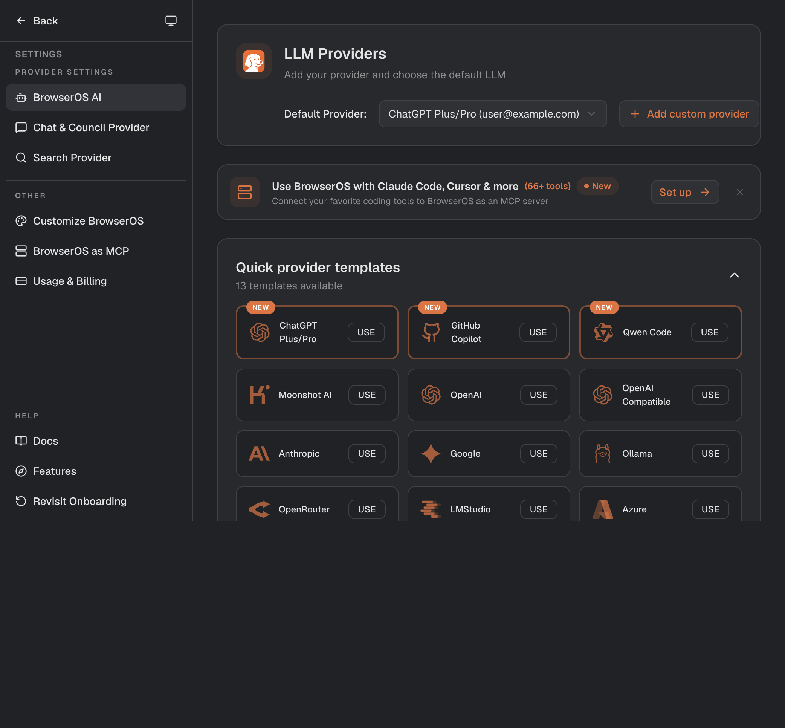
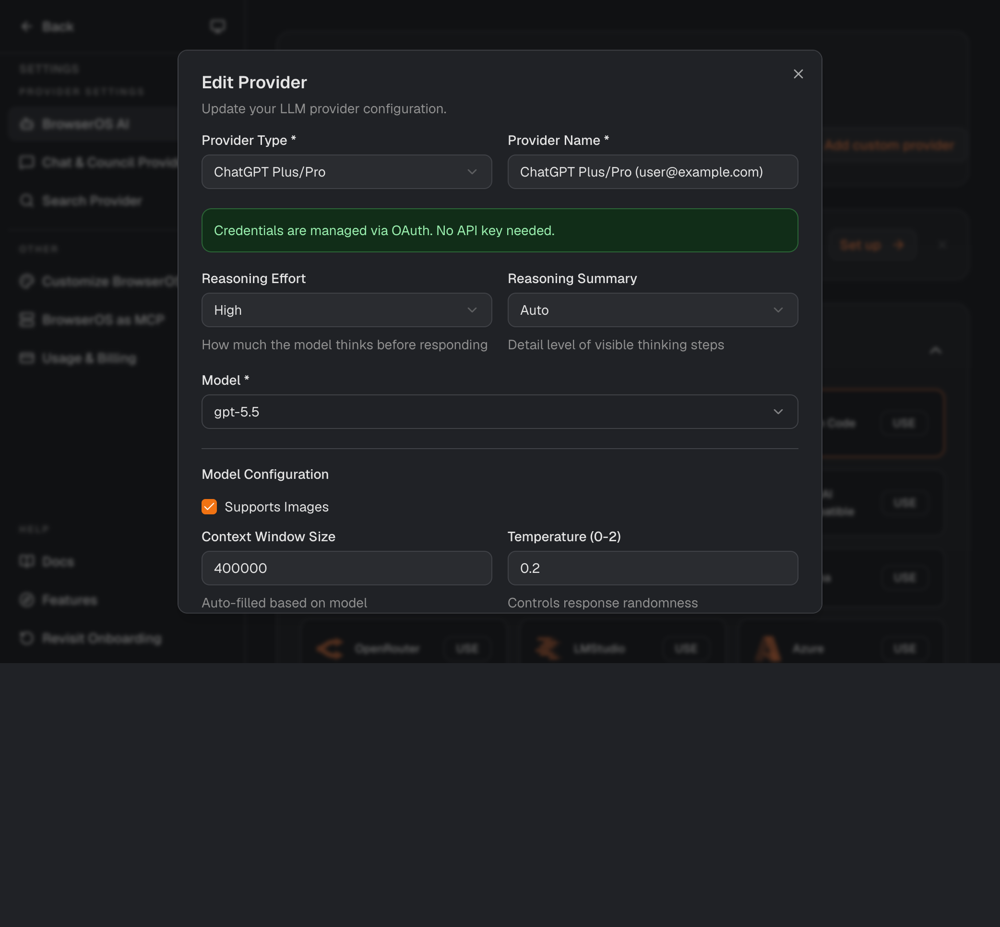
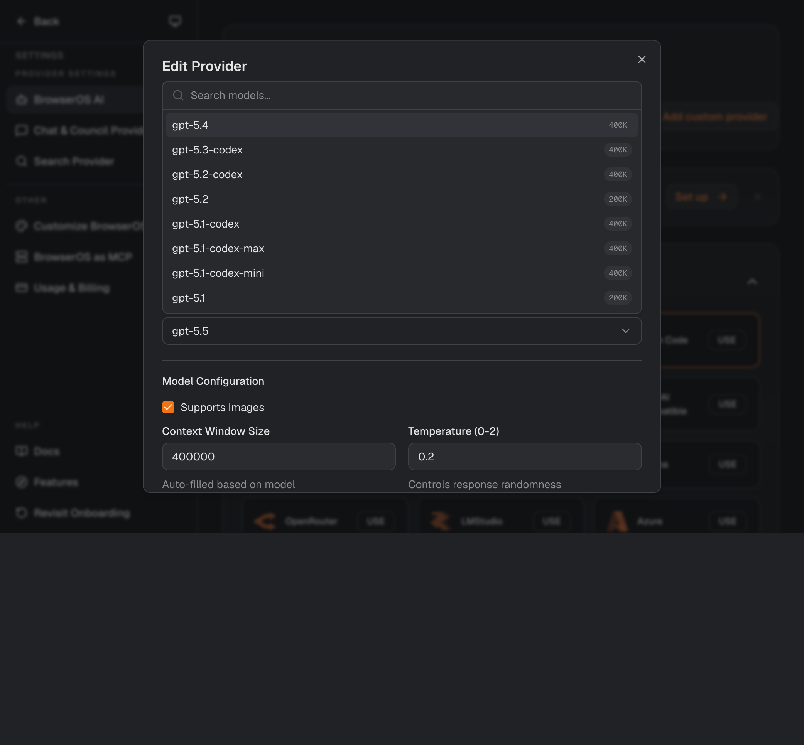

# BrowserOS Skills Suite

Public BrowserOS skill packages for LinkedIn search, outreach operations, job applications, resume tailoring, Outlook mail workflows, Google Sheets reliability, and grounded application-material review.

The repository is organized as one skill per leaf folder under `skills/<group>/`. Each skill has a `SKILL.md` file with BrowserOS-compatible front matter and concise instructions for an agent to follow.

## What Is Included

This repo includes 28 custom skills:

- Search and lead discovery: LinkedIn people search, Boolean refinement, KSA hiring posts, company mapping, hiring-post comment mining, scoring, deduplication, and search-state hygiene.
- Outreach operations: one-sheet Google Sheets outreach tracking, inbox preview backfill, row enrichment, daily operations, LinkedIn messaging, connection requests, document attachment, and safe post preparation.
- Job application support: LinkedIn Easy Apply preparation, job-to-resume fit ranking, batch shortlist tailoring, local LaTeX resume tailoring, cover letters, ATS keyword review, hallucination audits, final-draft review, and interview prep.
- Outlook workflows: connector-first draft/send reliability, local file attachment in Outlook web, and scheduled send verification.

BrowserOS built-in skills are not vendored here. This repo is for custom reusable workflows.

## Repository Layout

```text
browseros-linkedin-skills/
├── CONTRIBUTING.md
├── skills/
│   ├── google-sheets/
│   ├── linkedin/
│   ├── outlook/
│   ├── resume-application/
│   └── search-leads/
├── docs/
│   ├── README.md
│   ├── BROWSEROS_INSTALLATION.md
│   ├── PUBLICATION_AUDIT.md
│   ├── REPO_STRUCTURE.md
│   ├── SKILL_IMPROVEMENT_WORKFLOW.md
│   ├── SKILL_CATALOG.md
│   └── USAGE_IDEAS.md
└── scripts/
    └── install-browseros-skills.ps1
```

## Skill Groups

### Search and Lead Discovery

- `search-state-verification-hygiene` - clean search state, verify filters, avoid stale LinkedIn or Google results.
- `linkedin-people-url-filtering` - build repeatable LinkedIn People search URLs with connection, location, and company filters.
- `linkedin-boolean-query-refinement` - improve noisy LinkedIn searches with role/title Boolean logic.
- `linkedin-ksa-recent-hiring-posts` - find recent Saudi Arabia hiring posts with LinkedIn-first recovery and contact-route scoring.
- `linkedin-company-opportunity-mapper` - inspect LinkedIn company pages for jobs, posts, people, contacts, and opportunity signals.
- `linkedin-hiring-post-comment-miner` - mine hiring-post comments for recruiters, referral routes, clarifications, and useful pivots.
- `lead-scoring-dedup-pivots` - score raw leads, remove duplicates, and decide next pivots.

### Outreach Operations

- `linkedin-outreach-sheet-workflow` - one-sheet `Outreach` model for tracking people and next actions.
- `linkedin-inbox-preview-backfill` - quickly backfill recent LinkedIn conversations from inbox previews.
- `linkedin-row-enrichment` - improve selected outreach rows from profiles or threads.
- `linkedin-outreach-daily-ops` - maintain replies, follow-ups, and queue state without rebuilding the sheet.
- `google-sheets-connector-reliability` - recover from flaky, partial, or timed-out Google Sheets writes.
- `linkedin-messaging-workflow` - send LinkedIn messages from verified existing threads.
- `linkedin-attach-document-workflow` - attach and send local documents in LinkedIn message threads.
- `linkedin-connection-workflow` - send profile-based LinkedIn connection requests and verify invite state.
- `linkedin-poster-workflow` - prepare LinkedIn posts, media, documents, polls, and schedules while stopping before publish.

### Application Materials

- `linkedin-job-resume-fit-ranking` - rank LinkedIn jobs or posts against evidence from a resume.
- `linkedin-shortlist-resume-batch-tailoring` - generate one truthful tailored resume per ranked opportunity.
- `local-latex-resume-tailoring` - tailor a LaTeX resume locally with auditable content selection.
- `grounded-cover-letter-generator` - draft cover letters grounded in a resume, job requirements, and user-approved story.
- `ats-keyword-density-review` - check keyword coverage and stuffing risk without adding unsupported terms.
- `resume-hallucination-risk-audit` - audit edited application materials for unsupported facts.
- `resume-applied-draft-review` - compare original and accepted resume drafts for improvement or regression.
- `company-interview-prep-brief` - combine concise company research with resume-grounded interview prep.
- `linkedin-easy-apply-application-workflow` - prepare LinkedIn Easy Apply applications and stop before final submit.

### Outlook Mail

- `outlook-mail-connector-reliability` - use Outlook Mail connector actions first and fall back only for verified gaps.
- `outlook-connector-draft-attach-send` - create connector drafts, attach local files in Outlook web, verify, and send.
- `outlook-scheduled-send-workflow` - schedule Outlook emails with explicit time, timezone, and scheduled-state verification.

## Safety Defaults

These skills are intentionally conservative:

- They do not invent resume facts, credentials, metrics, employers, dates, or outcomes.
- They require explicit confirmation before final application submission.
- They treat names, profile URLs, email addresses, phone numbers, message snippets, private filenames, and application materials as sensitive.
- They prefer redacted labels in chat summaries unless exact identifiers are required.
- They verify UI state before sending messages, uploading sensitive documents, scheduling emails, or marking work complete.

## BrowserOS Setup And Installation

Use this path when setting up BrowserOS for these skills from the browser UI.

1. Open the Assistant tab, click settings, and go to BrowserOS AI provider settings.
2. Choose the `ChatGPT Plus/Pro` quick provider template and complete login.



3. Optional dev tip: click `Edit` on the provider card and override the frontend model to `gpt-5.5` if it is available on your account.



The model dropdown exposes the available frontend model overrides.



4. Click `Test` on the provider card or inside the edit dialog. Do not continue until the provider test works.
5. Open the Assistant tab and send:

```text
Install this repo and add them as skills:
https://github.com/AbdullahMadoun/browseros-linkedin-skills

After installing, update persistent memory to know exactly how to utilize them.
```

If installing from a fork, replace the GitHub URL with the fork URL.

See [docs/BROWSEROS_INSTALLATION.md](docs/BROWSEROS_INSTALLATION.md) for the full step-by-step setup notes and verification checklist.

## Manual Installation

From the repository root on Windows:

```powershell
.\scripts\install-browseros-skills.ps1
```

The repo groups skills visually by use case, but the installer scans those groups recursively and installs each skill as a top-level BrowserOS skill folder.

By default, the script copies only missing skills into:

```text
$env:USERPROFILE\.browseros\skills
```

To overwrite existing installed skills:

```powershell
.\scripts\install-browseros-skills.ps1 -Overwrite
```

## Usage

Start with [docs/README.md](docs/README.md) for the documentation map.

Use [docs/SKILL_CATALOG.md](docs/SKILL_CATALOG.md) for a full skill list.

Use [docs/USAGE_IDEAS.md](docs/USAGE_IDEAS.md) for common chains such as:

- search LinkedIn for people
- find recent KSA hiring posts
- prepare LinkedIn posts without publishing
- rank jobs by resume fit
- tailor a shortlist into resumes
- prepare and stop at LinkedIn Easy Apply review
- draft or schedule Outlook email
- maintain an outreach tracker

To create or improve a skill, use [docs/SKILL_IMPROVEMENT_WORKFLOW.md](docs/SKILL_IMPROVEMENT_WORKFLOW.md). It describes the exploration prompt, the improvement pass, overlap checks, and what to report before adding a skill.

Use [docs/REPO_STRUCTURE.md](docs/REPO_STRUCTURE.md) when changing repository organization.

Use [CONTRIBUTING.md](CONTRIBUTING.md) for contribution options, folder placement rules, and the prompt structure for exploring new workflows.

## Contributing

Useful contributions include:

- adding a new skill for a repeatable workflow
- improving an existing skill after a better path is discovered
- documenting a workflow exploration pass
- adding safety checks for send, submit, upload, delete, or schedule actions
- cleaning private examples for public use
- improving usage chains, catalog entries, or group indexes

Recommended workflow prompt:

```text
We will explore [workflow]. Try it out, try all buttons and clicks, learn everything about it to find an optimal method of usage and all features related to it. Try it extensively using all paths possible, all clicks, and all buttons.
```

Then run an improvement pass:

```text
Any improvement areas or any paths that feel uncomfortable or slow to use? If applicable, do another pass of improvement.
```

Then add or update the skill only after checking overlap:

```text
Add it to my skills. Make sure there is minimal overlap with existing ones and report to me any issues.
```

## Public Repo Maintenance

Before publishing updates:

1. Use the exploration-first process in [docs/SKILL_IMPROVEMENT_WORKFLOW.md](docs/SKILL_IMPROVEMENT_WORKFLOW.md).
2. Add or update one skill per folder under the right `skills/<group>/` directory.
3. Keep `SKILL.md` front matter valid and match `name` to the folder name.
4. Remove personal paths, names, private filenames, and local machine details.
5. Update `README.md`, `skills/README.md`, `docs/SKILL_CATALOG.md`, and `docs/USAGE_IDEAS.md`.
6. Run the audit checks documented in [docs/PUBLICATION_AUDIT.md](docs/PUBLICATION_AUDIT.md).
